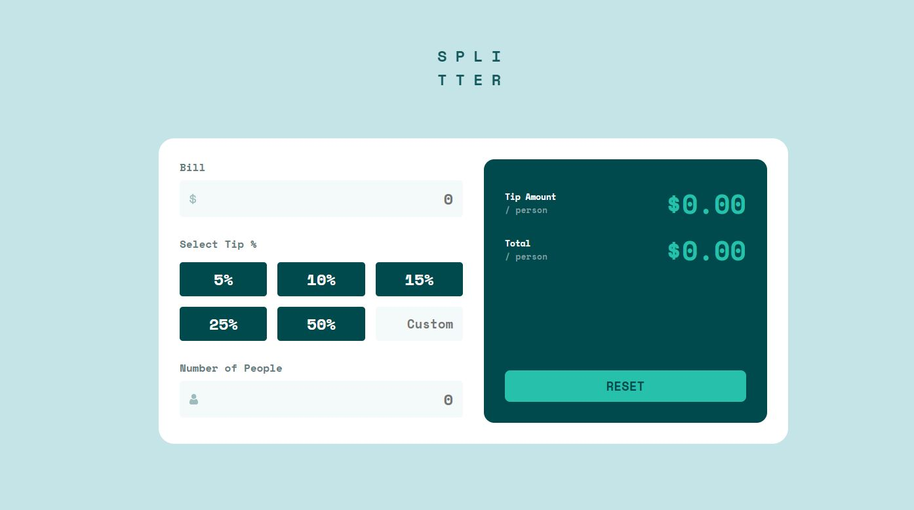

# Frontend Mentor - Tip calculator app solution

This is a solution to the [Tip calculator app challenge on Frontend Mentor](https://www.frontendmentor.io/challenges/tip-calculator-app-ugJNGbJUX). Frontend Mentor challenges help you improve your coding skills by building realistic projects.

## Overview

### The challenge

Users should be able to:

- View the optimal layout for the app depending on their device's screen size
- See hover states for all interactive elements on the page
- Calculate the correct tip and total cost of the bill per person

### Screenshot

### Links

- [Solution URL - To Be Done](https://your-solution-url.com)
- [Live Site URL - To Be Done](https://your-live-site-url.com)

## My process

### Built with

- Semantic HTML5 markup
- CSS custom properties
- Flexbox
- CSS Grid
- Mobile-first workflow
- Vanilla JS

### What I learned

TBD

## Tip Calculator JavaSscript Detailed Logic

### Understanding the problem

- Enter the Bill Amount
- Select Tip/Enter Custom Tip
- Enter Number of People (Cannot be Zero)
- Display the Tip & Total Amount per Person

### Tasks

- [X] Bill Amount
    * [X] select by id
    * [X] store the input
- [X] Tip Buttons and Custom Tip Input
    * [X] capture the parent element
    * [X] add switch case searching for target id
- [X] Number of people
    * [X] select by id
    * [X] check if it is 0 -> add styled css class
    * [X] else, parse and store the input
- [X] Display the amount
    * [X] Formula <- bill amount * number of people * tip %
    * [X] Display tip & total per person

## Author

- Frontend Mentor - [@Aditiholo-002](https://www.frontendmentor.io/profile/Aditi002-holo)
- Twitter - [@aditiintechk](https://twitter.com/aditiintechk)
